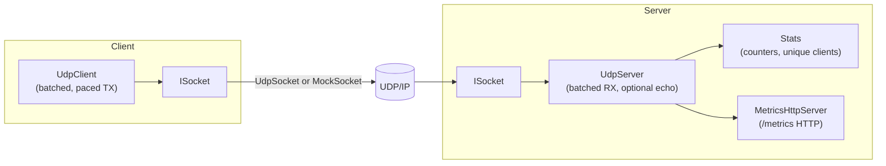
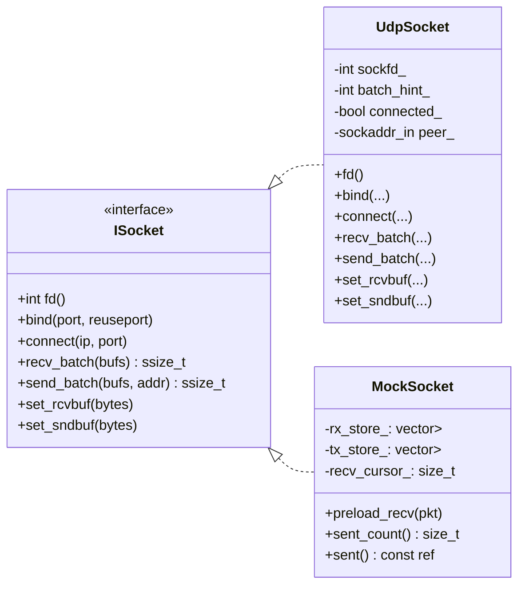
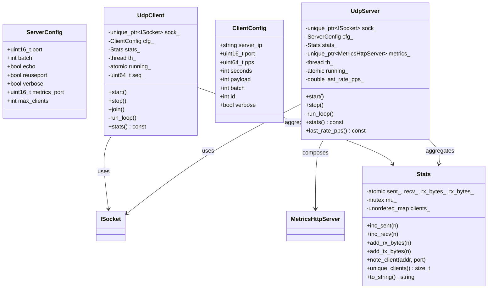
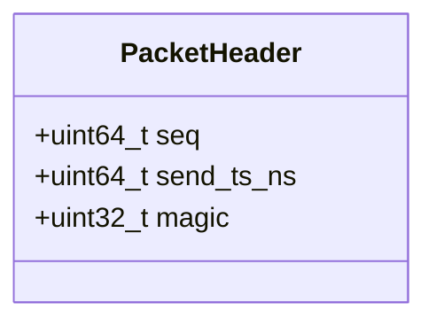
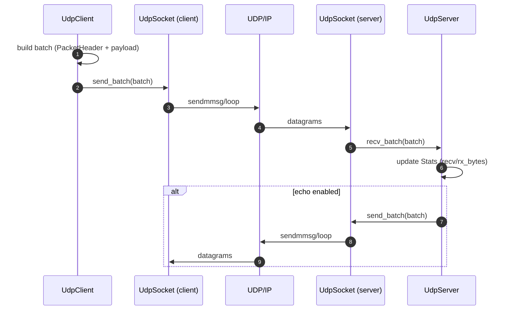

# UDP High-Rate C++ Server/Client
 
A high-performance UDP server/client in C++17 designed to sustain **≥100 kpps** (100,000 packets per second) on loopback or a capable NIC, serve **≥10 concurrent clients**, and include:
 
- End-to-end (E2E) demonstration script
- **GoogleTest** unit tests targeting **100% code coverage**
- UML-style diagrams (Mermaid + PlantUML sources) of design and flows
- Optional **Prometheus metrics** → **Grafana** dashboard
- Docker + docker-compose integration
- Clean, incremental Git commit plan
- **Configurable client cap**: server tracks/serves up to a maximum number of distinct clients (default **100**) via `--max-clients`
 
> Target platform: **Linux (x86_64)**. Uses Linux `recvmmsg/sendmmsg` for batching; falls back to `recvfrom/sendto` if unavailable.
 
---
 
## 1) Quick Start
 
```bash
git clone <this repo> udp-highrate-cpp
cd udp-highrate-cpp
mkdir -p build && cd build
cmake -DCMAKE_BUILD_TYPE=Release ..
make -j
```
 
### Run server
 
```bash
# Start server on UDP :9000, metrics on :9100, allow up to 100 distinct clients
./udp_server --port 9000 --metrics-port 9100 --batch 64 --max-clients 100
```
 
### Run 10 clients (each 10 kpps for 5s → ~100 kpps)
 
```bash
# From a second terminal
for i in $(seq 1 10); do
  ./udp_client --server 127.0.0.1 --port 9000 --pps 10000 --seconds 5 --payload 64 &
done
wait
```
 
Server prints periodic stats. You can also fetch metrics:
 
```bash
curl -s http://127.0.0.1:9100/metrics
```
 
---
 
## 2) E2E Demo (Loopback)
 
A helper script runs a self-contained demo on loopback:
 
```bash
./tools/run_e2e_local.sh
```
 
It builds the project (Release), starts the server, launches **10 clients** for **5 seconds**, and verifies we hit **≥100 kpps** on average. The server also tracks simple counters and (optionally) unique clients. By default the server permits up to **100** distinct clients, which comfortably covers this scenario.
 
> ⚠️ Throughput depends on hardware & kernel settings. The script uses loopback and generous defaults, but you may need to tune sysctls (e.g. `rmem_max`, `wmem_max`) for higher rates on real NICs.
 
---
 
## 3) Unit Tests & 100% Coverage
 
Build with coverage flags and run tests:
 
```bash
mkdir -p build-cov && cd build-cov
cmake -DENABLE_COVERAGE=ON -DCMAKE_BUILD_TYPE=Debug ..
make -j
ctest --output-on-failure
../tools/run_coverage.sh
```
 
This uses `lcov`/`genhtml` and **fails** the script if total line coverage < **100%**.
 
> Offline environments: if FetchContent cannot download GoogleTest, install system packages (e.g. `libgtest-dev`) and use `tools/build_with_system_gtest.sh` or point CMake to your install.
 
---
 
## 4) Design (UML / Mermaid)
 
Below is a detailed overview of the architecture and interactions. PlantUML `.puml` sources live under `diagrams/` (for advanced diagramming). GitHub renders the Mermaid versions inline here.
 
### 4.1 Component Overview
 

 
### 4.2 Class Diagram – Socket Layer
 

 
### 4.3 Class Diagram – Core
 

 
### 4.4 Packet Header
 

 
### 4.5 Data Path – Sequence (Send → Receive → Echo)
 

 
---
 
## 5) Prometheus & Grafana (Optional)
 
The server exposes `/metrics` (text exposition format) over HTTP (default port `9100`). Sample metrics:
 
- `udp_packets_received_total`
- `udp_packets_sent_total`
- `udp_unique_clients`
- `udp_rx_bytes_total`
- `udp_tx_bytes_total`
 
### Try with docker-compose (Prometheus + Grafana)
 
```bash
docker compose -f docker/docker-compose.yml up -d --build
# Server container starts on :9000 & metrics on :9100
# Prometheus scrapes server; Grafana at :3000 (admin/admin)
```
 
A starter Grafana dashboard lives at `tools/prom/grafana_dashboard.json`.
 
---
 
## 6) Docker
 
**Build**:
 
```bash
docker build -t udp-highrate:latest -f docker/Dockerfile .
```
 
**Run server**:
 
```bash
docker run --net=host --rm udp-highrate:latest \
  /app/bin/udp_server --port 9000 --metrics-port 9100 --batch 64 --max-clients 100
```
 
**Run client(s)**:
 
```bash
docker run --net=host --rm udp-highrate:latest \
  /app/bin/udp_client --server 127.0.0.1 --port 9000 --pps 10000 --seconds 5 --payload 64
```
 
> `--net=host` is used for maximum UDP performance in local demos.
 
---
 
## 7) CLI Reference
 
**udp_server**
 
```
--port <u16>           UDP listen port (default 9000)
--batch <int>          recvmmsg/sendmmsg batch size (default 64)
--metrics-port <u16>   HTTP metrics port (default 9100, 0=disabled)
--max-clients <int>    Maximum distinct clients to track/serve (default 100)
--echo                 Echo back payloads to sender (off by default)
--reuseport            Enable SO_REUSEPORT for scaling with multiple server procs
--verbose              Print per-second stats
--quiet                Suppress periodic logging
--help                 Show usage
```
 
**udp_client**
 
```
--server <ip>          Server IP (default 127.0.0.1)
--port <u16>           Server port (default 9000)
--pps <int>            Target packets per second (default 10000)
--seconds <int>        Duration (default 5)
--payload <int>        Payload bytes (default 64)
--batch <int>          sendmmsg batch size (default 64)
--id <int>             Client logical id (default 0)
--verbose              Print per-second stats
--help                 Show usage
```
 
---
 
## 8) Doxygen Docs & Diagrams
 
We embed Doxygen comments throughout headers and sources. To generate documentation:
 
```bash
# Install doxygen + graphviz (Ubuntu)
sudo apt-get install -y doxygen graphviz
 
# (Optional) PlantUML for .puml rendering
# sudo apt-get install -y plantuml
 
# From repo root
doxygen Doxyfile
```
 
Artifacts are written under `docs/html`. Open the entry page:
 
```bash
xdg-open docs/html/index.html  # or: open docs/html/index.html (macOS)
```
 
- The `Doxyfile` is configured to include `include/`, `src/`, `README.md`, and `docs/diagrams`.
- Graphviz is used for class/include/call graphs.
- PlantUML can render your `.puml` diagrams if `PLANTUML_EXECUTABLE` is set.
 
---
 
## 9) Limitations (Pros/Cons)
 
**Pros**
 
- High-throughput via Linux `recvmmsg/sendmmsg` batching
- Minimal dependencies, portable C++17 fallback
- Metrics ready for Prometheus/Grafana
- Unit tests targeting **100% coverage**
 
**Cons / Boundaries**
 
- Designed/tested for Linux; Windows requires adaptation
- Single-threaded server loop by default; scale by `--reuseport`
- E2E target depends on loopback/NIC + sysctls (see `tools/tuning.md`)
 
---
 
## 10) Future Work
 
- Multi-threaded RX/TX with lock-free queues, NUMA pinning
- Zero-copy paths (e.g., `io_uring`, AF_XDP) or DPDK adapter implementing `ISocket`
- Adaptive pacing in client (PID/Rate limiting) under congestion
- Richer metrics (latency histograms from `PacketHeader::send_ts_ns`)
- TLS for `/metrics` or reverse-proxy integration
- Config files and JSON schema (besides CLI)
 
---
 
## 11) Repo Structure
 
```
.
├─ CMakeLists.txt
├─ Doxyfile
├─ .gitignore
├─ .dockerignore
├─ README.md
├─ LICENSE
├─ include/udp/*.hpp
├─ src/*.cpp
├─ tests/*.cpp
├─ tools/
│  ├─ run_e2e_local.sh
│  ├─ run_coverage.sh
│  ├─ build_with_system_gtest.sh
│  └─ prom/{prometheus.yml,grafana_dashboard.json}
├─ diagrams/*.puml
├─ docker/{Dockerfile,docker-compose.yml}
└─ docs/            # Doxygen input (sources) and html/ output (generated)
   └─ html/         # Generated site (ignored by .gitignore/.dockerignore)

```
 
---
 
## 12) License
 
MIT
 
---